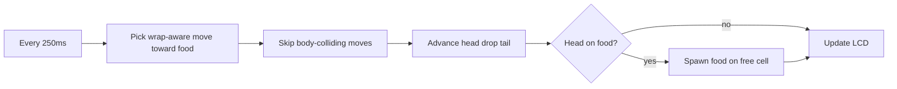

# Arduino LCD Snake Demo

## Hardware / stack

- **Board:** Arduino Leonardo (hardware I2C on D2/SDA, D3/SCL — already correct for this backpack)
- **Display:** [Adafruit 20x4 HD44780](https://www.adafruit.com/product/198) via [I2C/SPI backpack](https://www.adafruit.com/product/292)
- **I2C:** default address offset `0` (`0x20`), no A0–A2 jumpers
- **Power:** backpack `5V` and `GND` are powered from the Arduino Leonardo (same board as SDA/SCL)
- **Library:** [Adafruit_LiquidCrystal](https://learn.adafruit.com/i2c-spi-lcd-backpack/arduino-i2c-use) from Library Manager — use class `Adafruit_LiquidCrystal`: `Adafruit_LiquidCrystal lcd(0);`

## Repo layout (Arduino IDE)

```
adafruit-lcd-snake-demo/
  PLAN.md                 # this plan, saved into the repo
  README.md
  .gitignore
  snake_demo/
    snake_demo.ino        # single sketch (folder name = sketch name)
```

`.gitignore` will cover Arduino/IDE noise (build/, `*.hex`, `*.elf`, `.vscode/`, `.idea/`, OS junk, etc.).

## Game design (decided)

| Rule | Choice |
|------|--------|
| Control | Autonomous AI only — no player input |
| Grid | 20 columns × 4 rows (one LCD cell = one segment) |
| Snake length | Fixed **8** segments (does not grow on eat) |
| Food | One dot; on catch, remove and spawn at a random empty cell |
| Edges | **Wrap** (modulo 20 / 4) |
| Body | Prefer moves that avoid overlapping self |
| Tick | **250 ms** per step (`STEP_MS` constant) |

## Visuals (custom CGRAM)

HD44780 supports 8 custom characters. Use thin vertical/horizontal “body” bars and a distinct head so the snake is narrower than a full block (`0xFF`), within LCD limits:

- **Body:** mid-thickness glyphs oriented by travel direction (e.g. vertical bar for N/S, horizontal bar for E/W)
- **Head:** slightly thicker / arrow-like glyph facing current direction (reuse CGRAM slots by direction; 4 head + 2 body + 1 food ≈ 7 slots)
- **Food:** small centered dot glyph (or `'*'` if a CGRAM slot is tight)

Redraw strategy each tick: clear only dirty cells (old tail + old food + new head) or rewrite the full 20×4 frame buffer into the LCD — prefer a small RAM frame buffer (`char[4][20]`) then flush changed cells to keep I2C traffic reasonable on Leonardo.

## Autonomous chase logic

Each step:

1. Compute Manhattan target toward food, accounting for **wrap** (choose the shorter wrapped delta on X and on Y).
2. Candidate moves: prefer primary axis toward food, then secondary; also try remaining cardinals if blocked.
3. Reject a candidate if the next cell is occupied by the snake body (after wrap).
4. If all four directions collide with body, pick any move (or reverse) so the demo never hard-stalls.
5. Advance head, drop tail (fixed length 8), detect food collision → respawn food on a random free cell.

No score UI required unless space remains; keep the display dedicated to snake + food.



## Sketch structure (`snake_demo.ino`)

- Constants: `COLS=20`, `ROWS=4`, `SNAKE_LEN=8`, `STEP_MS=250`, I2C addr offset `0`
- Types: segment `{x,y}`, direction enum
- State: snake ring buffer / array of 8 segments, head index, direction, food position
- Setup: `lcd.begin(20,4)`, `setBacklight`, create custom chars, init snake centered, place first food, seed `random()` from `analogRead` on an unused pin
- Loop: non-blocking `millis()` step timer → AI → update → draw

## Docs

**[README.md](README.md)** (GitHub-style):

- Brief description + links to LCD / backpack / Snake genre
- Hardware wiring table: Leonardo D2 (SDA), D3 (SCL), 5V, GND → backpack (power from Arduino)
- Library install (`Adafruit LiquidCrystal`)
- Open `snake_demo/snake_demo.ino`, board = Leonardo, upload
- Contrast pot note; I2C address change note
- Behavior summary (autonomous, wrap, avoid body, 250 ms, length 8)

**[PLAN.md](PLAN.md):** save this approved plan into the repo root as requested.

## Out of scope

- Player controls / input hooks
- Growing snake / scoring
- PlatformIO / non-Arduino-IDE project files
- SPI mode on the backpack
